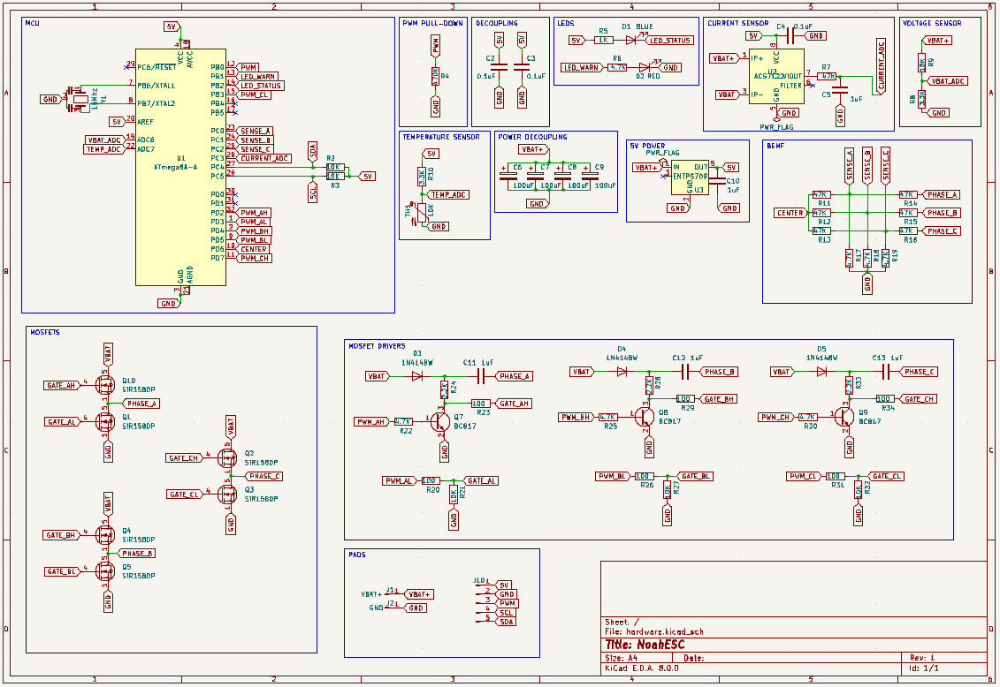
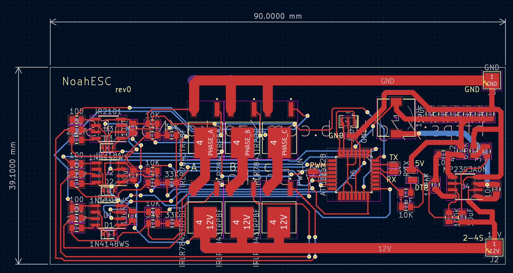
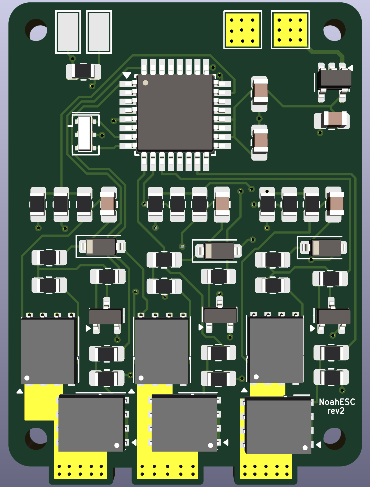

## [warning] - In Development - [warning]

# NoahESC
- Atmega328 based ESC.

### Features
- [X] PWM
- [X] Low cost
- [X] 30Amps
- [X] 2 - 4S battery
- [ ] Tested

## Scheme

## Boards Preview
Board|PCB
---------|---------
|
