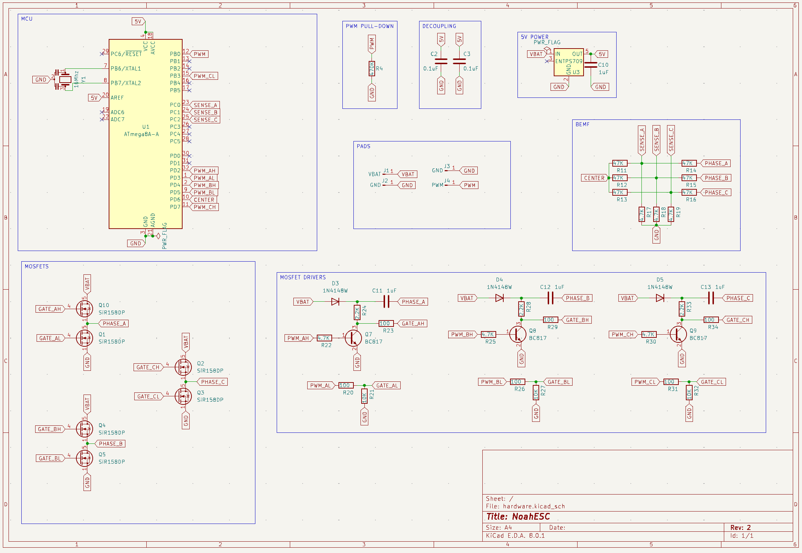

# NoahESC
The Atmega8-based Electronic Speed Controller (ESC) is a motor control device that uses the Atmega8 microcontroller as its main processing unit. It is designed to regulate the speed, direction, and braking of brushless DC (BLDC) motors or brushed motors, depending on the application. The Atmega8 handles the input signals—typically from a flight controller or receiver—and converts them into precise pulse-width modulation (PWM) outputs to control the motor’s performance. This type of ESC is widely used in drones, RC vehicles, and robotics projects due to its reliability, programmability, and compatibility with open-source firmware such as TGY. Overall, it provides an efficient and flexible solution for motor speed control in embedded and hobbyist applications.

### Features
- [X] PWM
- [X] 30Amps
- [X] 2 - 4S battery
- [X] Low cost

## Scheme

## Boards Preview
Board|PCB
---------|---------
|

### Flashing
Atmega8 must be flashed via ICSP microcontroller pins. 

**Arduino UNO as ISP programmer**
- `avrdude -c stk500v1 -p m8 -P /dev/tty.usbmodem14401 -b 19200 -U flash:w:firmware.hex:i`
- `avrdude -c stk500v1 -p m8 -P /dev/tty.usbmodem14401 -b 19200 -U lfuse:w:0x3f:m -U hfuse:w:0xca:m`

**USBasp**
- `avrdude -c usbasp -p m8 -U flash:w:firmware.hex:i`
- `avrdude -c usbasp -p m8 -U lfuse:w:0x3f:m -U hfuse:w:0xca:m`

**Download**: [Firmware](firmware.hex)

## PCB Design

**Huge thanks to [PCBWay](https://pcbway.com) for sponsoring this project!**

PCBWay is a leading provider of high-quality printed circuit boards (PCBs), offering reliable and affordable solutions for both hobbyists and professionals. Their services include rapid prototyping, PCB assembly, instant online quotations, expert design verification, and a streamlined ordering experience.

Their comprehensive range of services includes:
- PCB prototyping
- Assembly services
- Instant online quotations
- Expert design verification
- A streamlined, user-friendly ordering system
